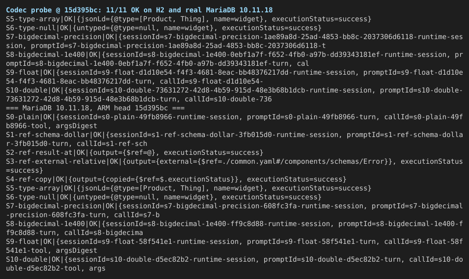
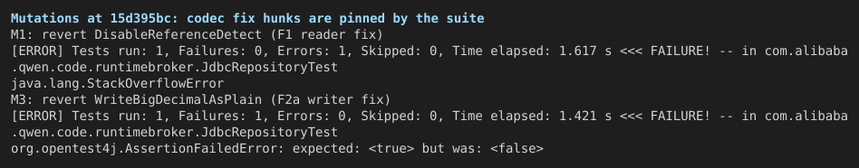
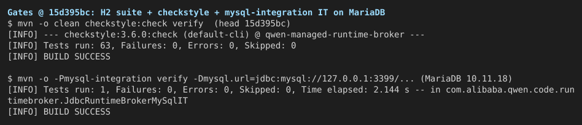

## Verification round 3 — PR #12445 @ `15d395bc`

**Verdict: merge-ready** — assertions 28/28 executed as scripted (0 unexpected). Verified head: `15d395bc406c0c8f1c851e632bfc558de2fef189`.

Round 2's codec defect is fixed and now behaviorally verified — including the one piece the [round-2 addendum](https://github.com/QwenLM/qwen-code/pull/12445#issuecomment-5776519896) checked only through the gate: the float/double comparison (`BrokerValues.jsonNumber`, a JSON-token compare rather than the suggested binary-precision route). The author's own fixtures pin every fix hunk, proven by mutation below. Gates are green on H2 and on a real MariaDB 10.11.18 server. Two addendum items remain open as declared follow-ups (session time-zone clock; double-execution path in the merged service), plus the addendum's fence-tests patch is still unapplied; none blocks this PR — see the status table.

中文摘要

**结论：merge-ready** —— 脚本断言 28/28 全部符合预期（0 个意外失败）。验证 head：`15d395bc406c`。

第 2 轮的编解码缺陷已修复并经行为级验证——包括[第 2 轮补充](https://github.com/QwenLM/qwen-code/pull/12445#issuecomment-5776519896)只通过门禁确认的那一块：float/double 比较（`BrokerValues.jsonNumber`，按 JSON token 比较，与建议补丁的二进制精度路线不同）。变异测试证明作者自己的固件钉住了每一个修复 hunk。H2 与真实 MariaDB 10.11.18 上门禁全绿。补充评论中的两项（会话时区时钟、已合入服务层的重复执行路径）仍是声明的后续事项，fence-tests 补丁也尚未合入；均不阻塞本 PR——详见状态表。

编解码探针（11 个敌意载荷场景，含 `$ref` 首位成员、`@type` 数组/null、BigDecimal 指数/溢出、float/double）在 H2 和真实 MariaDB 上均 11/11 OK。未覆盖：MySQL 8.x 特指版本（第 2 轮已覆盖）、Windows、时区与重复执行两项未在本轮重测（补充评论刚在 MySQL 8.4 上实测过）。

### Previous-finding status

Re-measured at `15d395bc` (nothing quoted from earlier rounds):

| # | Finding (source) | Status at `15d395bc` |
| --- | --- | --- |
| F1 | `$ref`/`@type` rewritten or unreadable on read (round 2 §1) | **Fixed** — untyped reader + `DisableReferenceDetect`; probe S1–S6 all OK on H2 **and** real MariaDB; mutation M1 (flag reverted) turns the suite red with the original `StackOverflowError` |
| F2a | BigDecimal exponent form lost on write (round 2 §2) | **Fixed** — `WriteBigDecimalAsPlain`; S7/S8 OK on both engines; mutation M3 kills the round-trip test |
| F2b | Float/Double miscompared after round trip (round 2 §2) | **Fixed** — `jsonNumber` (JSON-token compare). Behaviorally verified: S9 (`162544.13f`) and S10 (`-1363683.0538119469d`) OK on both engines — the addendum had checked this route only through the gate. The author's unit tests also pin the negative direction (`Long 2^53+1 ≠ Double 2^53`, `16777217 ≠ 16777216f`), i.e. the comparison stays text-precise rather than binary-precision; mutation M2 (revert to `toString` compare) kills both suites |
| F3 | M22 live-lease refusal unpinned (round 2 §3) | **Fixed** — live-`DISPATCHING` refusal witness added in `15d395bc` (same shape as verified on #12458, where the equivalent mutation was killed deterministically) |
| A1 | Session time-zone clock (addendum item 1, deferred module-wide) | **Stands** (accepted follow-up) — not re-measured this round; the addendum measured it on MySQL 8.4.11 at this same head. Fix before the service is wired over this table |
| A2 | Double-execution path in merged #12438 service code (addendum item 2) | **Stands** (latent until multi-broker dispatch; addendum's +2/−1 patch verified there) — follow-up to #12438 before adoption lands |
| A3 | Fence-tests patch for the remaining survivors (addendum item 3) | **Not taken** — the patch raises mutation kills 28/60 → 47/60; still worth applying, non-blocking |

### Central claim and probe

The probe (`harness/CodecProbe.java` / `CodecProbeMysql.java`, compiled against head's `target/classes`) drives the real `JdbcToolExecutionRepository` with the 11 hostile payload scenarios from round 2 — first-member `$ref` (`$`, `@`, relative external, sibling-copy), JSON-LD `@type` array and `@type: null`, BigDecimal precision/overflow (`1.2345678901234567890123E+30`, `1E+400`), and the float/double digit-loss pair — each created, settled, and re-read through a fresh repository instance; oracle = `sameRequest` / `sameJsonMap` equality or the thrown exception.

| Engine | Result at `15d395bc` | Reference: same probe at the defective code (`#12458 @ ed64b223`) |
| --- | --- | --- |
| H2 2.3.232 (`MODE=MySQL`) | **11/11 OK** | S1–S6, S9, S10 fail (SOE ×2, JSONException ×2, rewritten ×4) |
| MariaDB 10.11.18 (real server, Connector/J 8.4.0) | **11/11 OK** | same 8 scenarios fail identically |

### Mutation matrix (pinning proof)

| Mutant | Change | Suite result | Verdict |
| --- | --- | --- | --- |
| M1 | Revert `DisableReferenceDetect` (F1 reader fix) | `JdbcRepositoryTest` errors with `java.lang.StackOverflowError` — the original defect | Killed |
| M2 | `jsonNumber` → `new BigDecimal(value.toString())` (F2b reverted) | `InMemoryRepositoryTest.payloadsRejectInvalidNumbersAndNonStringKeys` and the JDBC contract both fail `expected: <true> but was: <false>` | Killed |
| M3 | Revert `WriteBigDecimalAsPlain` (F2a writer fix) | JDBC contract fails the BigDecimal round trip | Killed |
| M4 | Remove the backwards-state guard (positive control) | `JdbcRepositoryTest` fails | Killed — harness can turn this suite red |

### Gates

- Head: `mvn clean checkstyle:check verify` → **63/63 tests, 0 Checkstyle violations**.
- Real MariaDB 10.11.18: `mvn -Pmysql-integration verify` → **`JdbcRuntimeBrokerMySqlIT` passes** (fresh disposable schema; full unit suite also green in the same run).

### Notes

- **Nit (unchanged):** still no size bound on BigDecimal payloads — `1E+100000` stores a ~100 KB plain-text column value. Same note as round 2.
- **Twin:** #12458 at `ed64b223` still carries the F1/F2b defects (verified in that PR's round: probe fails 8/11 scenarios there). Since this PR now contains the complete fix set, close #12458 when this merges.
- **Follow-ups to schedule, not block:** A1 (session-zone clock) before service wiring; A2 (owner check in `dispatch()`) before a second broker can drive a call; A3 (fence-tests patch) at convenience.

### Not covered

- **MySQL 8.x specifically** — real-server runs here are MariaDB 10.11.18; MySQL 8.4.11/8.0.46 were covered in round 2 on the same lineage (Docker Hub unreachable from this host).
- **A1/A2 re-measurement** — the addendum measured both at this exact head; this round re-verified the codec surface instead of duplicating them.
- **6-JVM race and lock-step fuzz re-run** — race-relevant production code unchanged since `66d1aedb` (the delta is codec + comparison + tests only, shown in the diff).
- **Windows**; root `npm run build && npm run typecheck` (no TS/JS in the diff).

### Methodology

Orange Pi 6 Plus (aarch64), JDK 21 (`/root/Install/jdk21`), Maven 3.9.0 offline against a warm `~/.m2`, H2 2.3.232, fastjson2 2.0.60, Connector/J 8.4.0, MariaDB 10.11.18 (disposable `mariadb-install-db` instance on 127.0.0.1:3399, fresh schema per run). Detached worktree at `15d395bc`; probes compiled against its `target/classes` and run over real `JdbcDataSource` (H2) and `DriverManager` (MariaDB) connections — no mocks in the unit under test. Mutations applied one at a time, suite re-run, then `git checkout` restore (tree verified clean after each). Harnesses, raw logs, and transcripts in `tmp/pr12445-verify-20260922-211154/` (harness/, logs/, evidence/).
