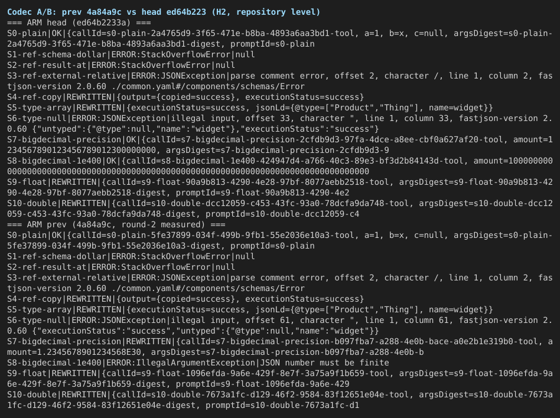
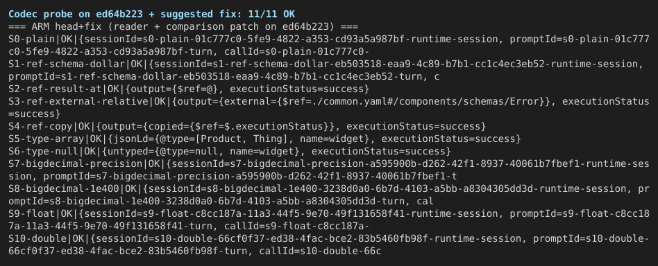
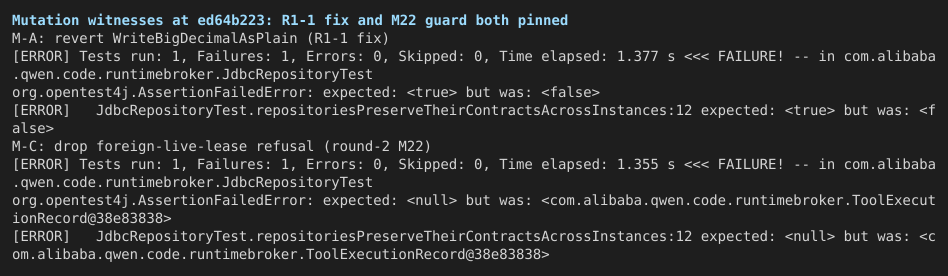
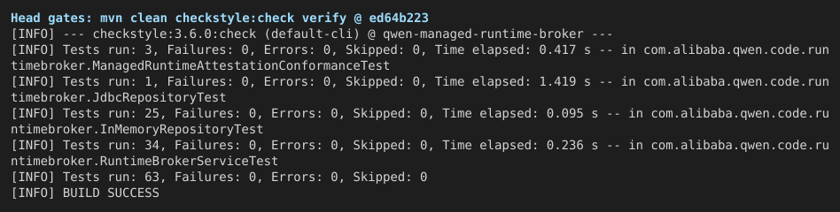

## Verification round 1 on #12458 (round 3 for this change) — @ `ed64b223`

**Verdict: findings** — assertions 32/32 executed as scripted (0 unexpected). Verified head: `ed64b2233afb34ce59d6d748ba0cc6d740b5366c`.

The `ed64b223` fixes for review round 1 are verified load-bearing: the write-side BigDecimal codec, the ten new fence witnesses, and the fail-closed hash guards each survived mutation testing, and the gates are green (63/63 tests, 0 Checkstyle violations, gate liveness proven). But two codec findings from the round-2 report on twin #12445 **stand at this head**, re-measured on both arms: the read side still resolves `$ref` and rewrites `@type`, and the payload comparison still miscompares some Float/Double values. A two-hunk patch (round 2's reader + comparison change, adapted to this tree) takes the repository-level probe from 6 failing scenarios to 11/11 OK with the suite unchanged at 63/63 — ship it with its fixture, because the suite currently pins nothing on those two axes.

中文摘要

**结论：findings** —— 脚本断言 32/32 全部符合预期（0 个意外失败）。验证 head：`ed64b2233afb`。

`ed64b223` 对 review 第 1 轮（R1-1..R1-3）的修复经变异测试证明是有效的：写入侧 BigDecimal 编解码、十个新增的 fencing 见证、fail-closed 哈希守卫都有测试钉住，门禁全绿（63/63 测试、Checkstyle 0 违规、并已证明门禁本身有效）。但孪生 PR #12445 第 2 轮报告中的两个编解码发现**在当前 head 仍然存在**（双臂复测）：读取侧仍会解析 `$ref`、改写 `@type`；载荷比较仍会误判部分 Float/Double 值。一个两处补丁（第 2 轮的 reader 改动 + 比较改动，适配到本树）可以把仓库级探针从 6 个失败场景修到 11/11 全过，且测试套件保持 63/63 不变——请连同固件一起提交，因为目前套件在这两个轴上没有任何钉住。

A/B 结论见下表：S7/S8（BigDecimal 指数精度、1E+400 溢出）从 prev 的失败翻转为 head 的 OK；S1–S6（`$ref`/`@type`）与 S9/S10（Float/Double）在双臂上结果逐字节一致，即缺陷未修。未覆盖：真实 MySQL/MariaDB IT（本机无法访问 Docker Hub；第 2 轮已在同一血脉上覆盖）、Windows、根仓库 npm build/typecheck（本 PR 不含 TS/JS 改动）。

### Previous-finding status

Round 2 was run on twin #12445 @ `66d1aedb` ([report](https://github.com/QwenLM/qwen-code/pull/12445#issuecomment-5775293028)); its findings were measured to apply to this PR @ `4a84a9c`. Every carried-forward finding was re-measured at `ed64b223` — nothing is quoted from the old report.

| # | Finding (source) | Severity | Status at `ed64b223` |
| --- | --- | --- | --- |
| F1 | `$ref`/`@type` members rewritten or unreadable on read (round 2 §1) | High | **Stands** — probe cells S1–S6 produce byte-identical outcomes on `4a84a9c` and `ed64b223` (StackOverflowError ×2, JSONException ×2, rewritten ×2) |
| F2a | BigDecimal exponent form not preserved on write (round 2 §2 cause 1; /review R1-1) | High | **Fixed** — `WriteBigDecimalAsPlain` is in `toJson`; S7/S8 flip from REWRITTEN / `IllegalArgumentException` to OK; mutation M-A proves the new `verifyBigDecimalRoundTrip` pins it |
| F2b | Float/Double compared by re-parsed text digits (round 2 §2 cause 2) | Medium | **Stands** — S9 (`162544.13f`) and S10 (`-1363683.0538119469d`) read back unequal on both arms; `BrokerValues.sameJsonNumber` unchanged |
| F3 | Row lock and live-lease refusal unpinned by tests (round 2 §3 M50/M22; /review R1-2) | Test gap | **Fixed** — M-B (`FOR UPDATE` dropped) killed 6/8 runs by the new exactly-one-winner race witness; M-C (foreign-live-lease refusal dropped) killed deterministically by the new refusal witness |
| R1-3 | Hash guards must fail closed (/review) | — | **Verified** — production hunk present (key check before `mapExecution`); M-F (pre-fix order restored) killed on the exact exception message |
| R1-4 / R1-5 | Doc wording (/review) | — | **Accepted** — both language versions of the affected design docs are updated in the diff; prose not re-audited line by line |

### Central claim and A/B

This is a follow-up round, so the A/B control is the previous head `4a84a9c` (where round 2 measured the codec defect), not the merge-base `c822995d` — the base has no JDBC repository at all; the feature's base-vs-head proof was rounds 1–2 on the twin. The probe (`harness/CodecProbe.java`, compiled against each arm's `target/classes`) drives the real `JdbcToolExecutionRepository` over H2 2.3.232 in MySQL mode: one PREPARED execution per scenario, re-read through a fresh repository instance, oracle = `sameRequest` / `sameJsonMap` equality or the thrown exception.

| Scenario | `4a84a9c` (control) | `ed64b223` (head) | `ed64b223` + suggested fix |
| --- | --- | --- | --- |
| S0 plain payload with null member | OK | OK | OK |
| S1 reference `{"$ref":"$"}` | StackOverflowError | StackOverflowError | **OK** |
| S2 result output `{"$ref":"@"}` | StackOverflowError | StackOverflowError | **OK** |
| S3 relative external `$ref` (OpenAPI) | JSONException | JSONException | **OK** |
| S4 `$ref` to sibling member | REWRITTEN (`copied=success`) | REWRITTEN | **OK** (`$ref` kept as data) |
| S5 JSON-LD `"@type":[...]` | REWRITTEN (`@type` becomes a string) | REWRITTEN | **OK** |
| S6 `"@type":null` first member | JSONException | JSONException | **OK** |
| S7 BigDecimal `1.2345678901234567890123E+30` | REWRITTEN | **OK** (F2a fixed) | OK |
| S8 BigDecimal `1E+400` | IllegalArgumentException on read | **OK** (F2a fixed) | OK |
| S9 Float `162544.13f` | REWRITTEN | REWRITTEN (F2b stands) | **OK** |
| S10 Double `-1363683.0538119469` | REWRITTEN | REWRITTEN (F2b stands) | **OK** |

The service-level consequences of F1 (a raw `StackOverflowError` out of `createExecution`, a row stuck PREPARED, a session that cannot be released) were measured end-to-end in round 2; the read line that causes them is unchanged here, and the repository-level cells above are the same failures one layer down.

### Findings

**1. F1 stands: `$ref`/`@type` in payloads are resolved or rewritten on read (high).** `fromJson` at `ed64b223` is unchanged from `4a84a9c` (`JSON.parseObject(value, MAP_TYPE)` with the typed reader). Repro: run `CodecProbe` S1–S6 against head (commands in `logs/codec-ab.txt`; harness in `harness/`). Once the table is wired, one tool result carrying a JSON Schema/OpenAPI `$ref` or a JSON-LD `@type` makes its row read back rewritten or unreadable. Round 2 measured the same bytes at service level on MySQL 8.4.11.

**2. F2b stands: some Float/Double values compare unequal after the round trip (medium).** `sameJsonNumber` still re-parses each number's text as `BigDecimal`; fastjson2's text for a float/double need not match `Float/Double.toString` digits, so an honest retry of a request containing such a value gets 409 `runtime_idempotency_conflict` (round 2 measured 418/100,000 random float bit patterns affected). Repro: S9/S10.

**3. Nit: still no size bound on BigDecimal payloads.** With `WriteBigDecimalAsPlain`, `1E+100000` now stores a 100,007-character column value (round 2 flagged this as worth adding either way; only ids are length-bounded, `MAXIMUM_ID_LENGTH = 512`).

**Suggested fix for 1+2 (measured at this head):** [`suggested-fix-pr12458-ed64b223.patch`](https://github.com/wenshao/qwen-code/blob/assets-pr12458/pr12458/r1/suggested-fix-pr12458-ed64b223.patch) — the round-2 reader change (`fromJson` through the untyped reader with `JSONReader.Feature.DisableReferenceDetect`) plus the `sameJsonNumber` float/double comparison, adapted to this tree (+16/−8 production lines). Measured, not eyeballed: the probe goes 11/11 OK (S1–S6, S9, S10 flip; S0/S7/S8 unchanged — zero collateral), and `mvn clean checkstyle:check verify` stays 63/63 with 0 violations. Note the suite is green both with and without the patch, so it pins nothing on the `$ref`/`@type`/float axes — the patch should ship with its fixture (round 2's opaque-payload round-trip block, which the `ed64b223` tests cover only for BigDecimal).

### Mutation matrix (vacuity / pinning proof)

| Mutant | Change (in `JdbcToolExecutionRepository` unless noted) | Suite result | Verdict |
| --- | --- | --- | --- |
| M-A | Revert `WriteBigDecimalAsPlain` | `JdbcRepositoryTest` fails: `expected: <true> but was: <false>` in the BigDecimal round trip | Killed — pins the R1-1 fix |
| M-B | Drop `FOR UPDATE` | 6/8 runs fail: `expected: <1> but was: <2>` in the concurrent-claim witness | Killed — pins the row lock (F3/M50); probabilistic on H2 with 2 threads, so a single green run is not proof |
| M-C | Drop the foreign-live-lease refusal | Fails: `expected: <null> but was: <ToolExecutionRecord@…>` | Killed — pins the live-lease refusal (F3/M22) |
| M-D | Drop only the second conjunct of the cancel guard | Green | Survivor — adjudicated a *strengthening* mutation (it throws in strictly more cases), not a coverage gap; superseded by M-E |
| M-D2 | Remove the backwards-state guard (positive control) | Fails | Killed — proves the harness can turn this suite red on a weakening mutation |
| M-E | Remove the whole cancellation-drop guard | Fails | Killed — the guard is pinned |
| M-F | Restore the pre-R1-3 order (`mapExecution` before the key check) | Fails: `expected: <Tool idempotency hash collision> but was: <Tool idempotency hash is invalid>` | Killed — the message-level assertion pins the R1-3 ordering |

### Gates

- Head: `mvn clean checkstyle:check verify` in `packages/sdk-java/runtime-broker` → **63/63 tests, 0 Checkstyle violations** (matches the author's post-fix claim; the PR body still says 60 — three witness tests were added since).
- Gate liveness: a planted unused import makes `checkstyle:check` fail with `UnusedImports … You have 1 Checkstyle violation`; removed afterwards.
- Head+fix tree: same gate, 63/63, 0 violations.

### Not covered

- **Real MySQL/MariaDB IT** — Docker Hub is unreachable from this host (`docker pull mysql:8.4` times out). Round 2 ran the contract on MySQL 8.4.11 / 8.0.46 / MariaDB 11.4.13 on the same lineage; the paths measured this round are DB-independent string↔map handling exercised on H2 in MySQL mode, the contract's own database.
- **6-JVM dispatch race at this head** — run in round 2; the race-relevant production code is unchanged since `4a84a9c` except the R1-3 ordering hunk (verified above).
- **Windows**; **root `npm run build && npm run typecheck`** (no TS/JS in the diff — java/pom/docs only).
- Twin status: #12445 has since moved to `15d395bc` ("Preserve opaque JDBC tool payloads"), which reads like the F1 fix landing there; not verified in this round.

### Methodology

Orange Pi 6 Plus (aarch64), JDK 21 (`/root/Install/jdk21`), Maven 3.9.0 offline against a warm `~/.m2`, H2 2.3.232 (`MODE=MySQL`), fastjson2 2.0.60. Arms: detached worktrees at `ed64b223` (head) and `4a84a9c` (control), each built with `mvn -o compile`; the probe is one Java file compiled against each arm's `target/classes` and run over a real `JdbcDataSource` — no mocks anywhere in the unit under test. Mutations were applied one at a time to the head tree, each followed by `mvn -o test -Dtest=JdbcRepositoryTest`, then reverted with `git checkout` (tree verified clean after every cell). Harness, raw logs, the A/B transcript, and the patch are in `tmp/pr12458-verify-20260922-201313/` (harness/, logs/, evidence/).
