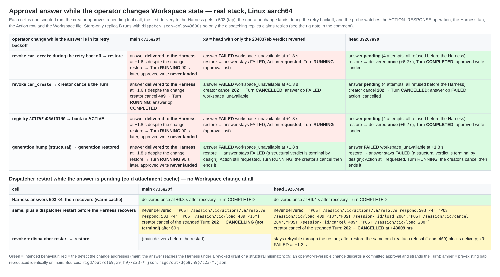
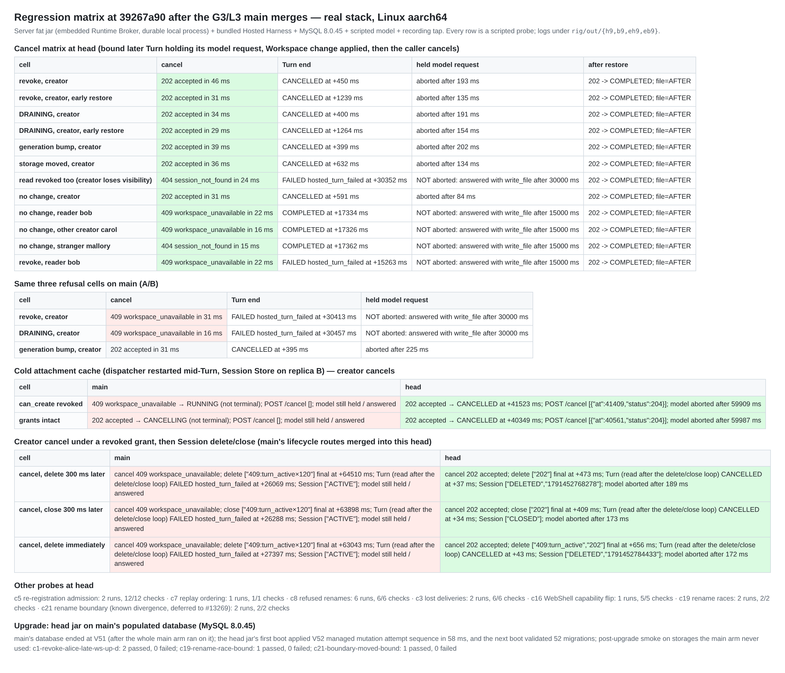
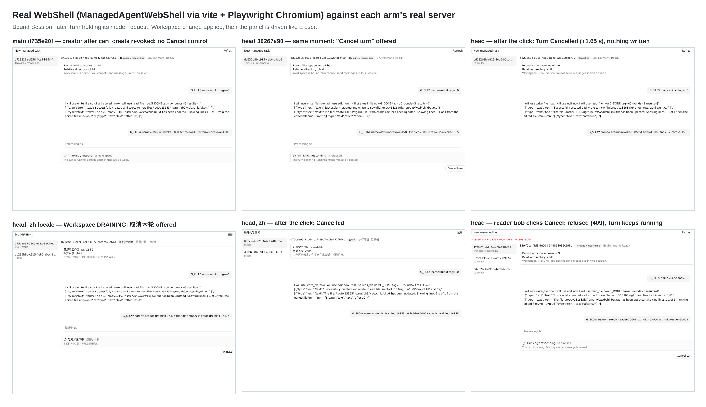
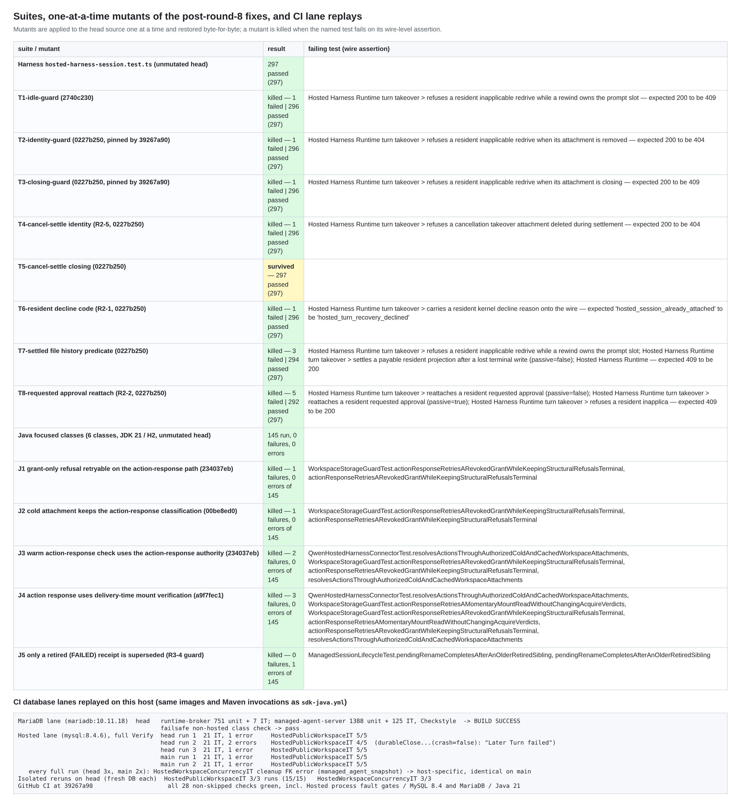

## Round 9: real-stack re-verification at `39267a90` (Linux aarch64), delta since round 8

**Verified head:** `39267a90f2a05b8940db7676fea1f2237678ae62`, the PR tip at posting time. [Round 8](https://github.com/QwenLM/qwen-code/pull/13163#issuecomment-6041063311) verified `f2864f6a`.

**What this round covers** is everything that landed after `f2864f6a`:
- five production fixes: `0227b250`, `a9f7fec1`, `234037eb`, `2740c230`, `00be8ed0`;
- the V51→V52 migration renumber;
- the test-only commits up to `39267a90`;
- the main merges that brought G3 (#13174), L3 (#13354) and #13658 into the branch.

**Arms.** Each arm runs its own server fat jar and its own bundled Harness:
- **head** `39267a90`;
- **main** `d735e20f`, the merge base;
- **x9**: head with only the `234037eb` verdict reverted. It is a one-line change in `WorkspaceExecutionStore`: `throw actionResponse ? unavailablePendingGrant() : unavailable();` becomes `throw unavailable();`.

A trial merge of head into current main `10078ddc` is conflict-free.

### Verdict: no blocker found at `39267a90`

- **The R3-1 fix works end to end.** Suppose `can_create` is revoked, or the registry goes DRAINING, while an approval answer is in its retry backoff.
  - Head keeps the answer pending, and nothing reaches the Harness. Once the operator restores the state, head delivers the answer **exactly once** (+6.2 s) and the Turn completes. If the creator cancels instead, the answer settles as `action_cancelled`.
  - x9 fails the answer terminally at +1.3 to 1.8 s. The Turn is then stranded on an approval that was already given.
  - Main delivers the answer to the Harness **despite** the revoked grant.
  - A structural change (generation bump) still fails terminally on head, as intended.
- **The G3/L3 merges did not regress the cancel paths.**
  - Unchanged from round 8: the 12-cell cancel matrix, cold-cache cancel, re-registration admission, replay ordering, refused renames, lost deliveries, and the WebShell capability flip.
  - New this round: a creator under a revoked grant cancels, then deletes or closes the Session. On head this completes (cancel 202 → CANCELLED; delete/close 202; model aborted). On main the cancel is refused, and delete/close answers `409 turn_active` for the full 60 s.
- **The migration upgrade works.** V52 applies cleanly on main's populated database in 58 ms, and the upgraded server passes a smoke run.
- **Mutation testing.** The PR's own tests kill 7 of 8 Harness mutants and 5 of 5 Java mutants of the post-round-8 fixes.
  - The killed set includes the three negative controls the author reported for `39267a90`. [qqqys's review](https://github.com/QwenLM/qwen-code/pull/13163#pullrequestreview-5453920145) recorded those as "claimed rather than verified"; they reproduce here.
  - One mutant survives. It is a coverage gap only (§5).
- **One pre-existing gap reproduced identically on main.** After a dispatcher restart, a pending approval answer is never delivered with the default configuration. This is not a regression, and head handles it better than main (§2).

### 1. Approval answer while the operator changes Workspace state (R3-1: `234037eb`, `00be8ed0`)

**Probe** (`c23-approve-retry.mjs`):
1. A later Turn waits on an approval, and the creator approves.
2. The tap answers the first `POST …/actions/:id/resolve` with 503, which puts the answer into the coordinator's retry backoff.
3. The operator change lands during that backoff.
4. The probe watches the `ACTION_RESPONSE` operation, the tap, the Action row and the Workspace file.
5. Finally, the probe either restores the state or has the creator cancel.

| Change during the backoff | main `d735e20f` | x9 (verdict reverted) | head `39267a90` |
| --- | --- | --- | --- |
| revoke `can_create` → restore | answer **delivered to the Harness** at +1.6 s despite the revocation. The approved write never lands, and the Turn is still RUNNING 90 s after the restore | `FAILED workspace_unavailable` at +1.8 s. After the restore the Action stays `requested` and the Turn waits indefinitely | **pending**: 4 attempts, all refused before reaching the Harness. After the restore it is **delivered once** at +6.2 s, the Turn ends COMPLETED, and the write lands |
| revoke → creator cancels | delivered; the cancel gets **409** and the Turn stays RUNNING | FAILED; cancel 202 → CANCELLED | pending; cancel 202 → CANCELLED; the answer settles as `action_cancelled` with no further attempts |
| registry DRAINING → ACTIVE | delivered despite DRAINING | FAILED; the Turn is stranded | pending, then delivered once (+6.2 s); COMPLETED |
| generation bump (structural) → restored | delivered | FAILED at +1.8 s | FAILED at +1.8 s: the structural verdict stays terminal, as intended. The creator's cancel ends the Turn |

**Additional runs:**
- In a single-dispatcher topology, revoke → restore delivered 3 of 3 times (12 s and 30 s holds).
- In the first topology (before the rig fix in §6):
  - unread (read and create both revoked) stays pending, then is delivered after the restore;
  - storage moved fails terminally.

### 2. Pre-existing, also on main: a pending approval answer is never delivered after a dispatcher restart

This is the lower half of the figure above. It is a control run with **no Workspace change at all**. The Harness answers 503 to every resolve. The dispatching replica restarts (cold attachment cache), and then the Harness recovers.

- **Warm cache (no restart):** main and head both deliver once, at +6.8 s and +6.4 s.
- **With the restart:** both arms stall. Every retry's cold reattach `POST /session/:id/load` gets `409 hosted_session_already_attached`, 13 to 15 times in 80 s, and the retries continue every 60 s after that.
- **Cause.** `qwen.managed-agent.runtime-broker.verified-workspace-recovery-enabled` defaults to `false`, so the action-response cold path loads non-passively:
  - on head, `doResolveAction` calls `doCreateOrLoad(…, verifiedRecoveryEnabled(), true)` (`QwenHostedHarnessConnector.java:438`);
  - on main, it calls `attachment(tenantId, sessionId, true)`.

  The Harness refuses any non-passive load of a resident Session (`hosted-harness-session.ts:2106`). This is the same family as the round 6 note about non-passive loads after a dispatcher restart.
- **The creator's way out differs.**
  - On head, the cancel ends CANCELLED at +43 s via this PR's cold-cancel path.
  - On main, the cancel is still CANCELLING 60 s later.
- **Consequence for this PR.** In the default configuration, the `00be8ed0` cold-path classification cannot be reached end to end, because the Harness refuses the reattach first.
  - It is pinned at unit level: J2 below, plus the author's real-JDBC test.
  - With revocation plus a restart, head keeps the answer retryable through the restart (not FAILED). After the restore it hits the same 409.

I suggest tracking this separately; it does not block this PR.

### 3. Regression matrix after the main merges

- **Cancel matrix (c1, 12 cells).**
  - A creator cancel under revoke, DRAINING, generation bump, storage moved, or no change (late and early restore) answers 202. The Turn ends CANCELLED at +0.4 to 1.3 s and the model request is aborted.
  - Refusals: reader bob and other creator carol get 409; stranger mallory, and a creator without read, get 404. No command row is written on refusal.
  - The refusal lifts about 2 s after the Turn ends, and the next Turn completes.
  - Main on the revoke and DRAINING cells: 409, the Turn runs on to FAILED at +30 s, and the model request is not aborted.
- **Cold attachment cache (c14: dispatcher restarted mid-Turn, Session Store on replica B).**
  - Head: cancel 202, then `load` 200, then `POST /cancel` 204. The Turn ends CANCELLED at +41.5 s with the grant revoked, and +40.3 s with grants intact. The model request is aborted.
  - Main: 409 and RUNNING when revoked; 202 and CANCELLING with `load 409` when grants are intact.
  - The #13413 writer latch did not occur (0 of 4 cold restarts).
- **Cancel, then delete or close (c24, new).**
  - Head: cancel 202, and the Turn is CANCELLED within about 0.5 s. Delete/close answers 202; when sent immediately, delete got one `409 turn_active` first. The Session ends DELETED or CLOSED, the model request is aborted, and nothing is written.
  - Main: the cancel gets 409, then delete/close gets `409 turn_active` ×120 over 64 s. The Turn keeps running and fails on its own about 90 s after the cancel; the Session is still ACTIVE.
- **Other probes, all passing:**
  - c5: 12/12;
  - c7: 1/1;
  - c8: 6/6;
  - c3: 6/6;
  - c16 (WebShell capability flip): 5/5;
  - f4b: CLOSED/ARCHIVED/DELETED refusals unchanged;
  - c19 rename race: the surviving retry wins, and the database and the Harness agree.
- **c21:** the known rename-boundary divergence still reproduces, as in rounds 6 to 8. The database has "Alpha" and the Harness's last title is "Bravo". This is deferred to #13269.
- **Upgrade.**
  - Start with main's database: V51, populated by the whole main arm.
  - On its first boot, the head jar applies V52 `managed mutation attempt sequence` in 58 ms; the next boot validates 52 migrations.
  - Smoke runs on storages main never used all pass: the c1 revoke cancel, c19 and c21.

### 4. WebShell in a real browser

ManagedAgentWebShell is served by vite and driven with Playwright Chromium against each arm's real server.

- **Head:** a creator with a revoked grant sees **"Cancel turn"** and clicking it ends the Turn Cancelled at +1.65 s. In the zh locale under DRAINING, **取消本轮** does the same.
- **Reader:** bob's click gets 409 with the alert "Hosted Workspace execution is not available.", and the Turn keeps running. This is the R1-6 Suggestion: the button is still shown to readers.
- **Main:** shows no Cancel control under the revoked grant.

### 5. Suites, mutants, CI lanes

- **Suites:**
  - Harness `hosted-harness-session.test.ts`: **297/297**.
  - Java focused classes on JDK 21 with H2: **145/145**. The classes are `WorkspaceStorageGuardTest`, `QwenHostedHarnessConnectorTest`, `ManagedActionsTest`, `ManagedSessionLifecycleTest`, `QwenHostedHarnessColdCancelRegressionTest` and `ManagedWorkspaceAdmissionTest`.
- **Mutants**, applied one at a time and restored byte-for-byte:
  - T1–T8 cover `2740c230` and `0227b250`, including both `39267a90` guards: **7 of 8 killed**, each on a wire-status assertion. For example, T2 fails with `expected 200 to be 404` and T3 with `expected 200 to be 409`.
  - J1–J5 cover `234037eb`, `00be8ed0`, `a9f7fec1` and the R3-4 `FAILED` precondition: **5 of 5 killed**.
  - J5 fails `pendingRenameCompletesAfterAnOlderRetiredSibling`. That is the author's R3-4 control.
- **The survivor (T5, Suggestion only).** Deleting the post-await `resident.mcpClosing` guard in the **cancellation-settle** arm (`hosted-harness-session.ts:2082-2085`, added by `0227b250`) leaves the suite at 297/297.
  - Its sibling identity guard (T4) is pinned, and so are both guards in `answerResidentInapplicable` (T2, T3).
  - A closing variant next to *refuses a cancellation takeover attachment deleted during settlement* would pin it.
- **CI database lanes replayed on this host,** with the same images and Maven invocations as `sdk-java.yml`:
  - **MariaDB lane:** BUILD SUCCESS. runtime-broker ran 751 unit tests and 7 IT; managed-agent-server ran 1388 unit tests and 125 IT; Checkstyle and the failsafe class check pass.
  - **Hosted MySQL 8.4 lane:** `HostedPublicWorkspaceIT` passed 5/5, 4/5 and 5/5 across three full runs on head. The single error was `durableCloseStopsOriginalWorkersAndRetainsHistoryAndFiles(crash=false)`: "Later Turn failed".
    - It passed 3 of 3 isolated reruns (15/15 tests) and 5/5 in both main runs. I count it as a one-off on this host.
  - **A host artifact.** Every full run on this host, three on head and two on main, also errors in `HostedWorkspaceConcurrencyIT` cleanup with a foreign key from `managed_agent_snapshot`, which its cleanup list omits. It is identical on main and passes 3 of 3 in isolation, so it comes from this host's test ordering.
  - **GitHub CI at this head:** all 28 build and test checks are green, including `Hosted process fault gates / MySQL 8.4 / Java 21` (where `HostedPublicWorkspaceIT` runs) and `Runtime Broker and Managed Agent MariaDB / Java 21`. The only other entries are a cancelled `route` dispatcher job and a queued `delay-automatic-review`.

### 6. A rig note on a pre-existing behaviour outside this PR

**The rig topology.** In this rig a second replica serves only the Session Store (`harness.enabled=false`). That avoids the #13413 latch when the dispatcher restarts.

**What that replica does.** Its `ActionResponseCoordinator` still scans for and claims `ACTION_RESPONSE` retries.
- It fails each one with `UnsupportedOperationException: Hosted Actions are unavailable`, which is the default `HarnessConnector.resolveAction`.
- Each failure pushes `available_at` out by the backoff.

**The effect on my first runs.** Head's retryable answers live longer than main's. In two of my first four warm restore runs, this replica won every claim after the restore (6 consecutive claims in the traced run), so delivery stalled.

**The fix.** Either neutralising that replica (`dispatch.scan-delay=3600s`) or running a single dispatcher restored the expected delivery, 6 of 6 times. Every number above comes from the neutralised topology.

**Scope.** This only matters if a deployment shares a database between harness-disabled replicas and dispatching ones. This PR does not change the coordinator beyond the terminal exit.

### Not covered

- **R2-3 (transient mount I/O) end to end.** It needs an I/O error on a mount read by a root process; J4 covers it.
- **The Harness-internal windows of `2740c230` and `0227b250`** (prompt slot, teardown). Unit tests and mutants cover them only.
- **`verified-workspace-recovery-enabled=true`**, where the cold action-response path would load passively.
- **A real model; macOS or Windows on this head; MySQL 8.4 or MariaDB on the real-stack rig.** CI and the local lane replays cover those databases.

### Methodology

- **Real-stack rig:** Orange Pi 6 Plus, Linux aarch64, Node 24.14.0, JDK 21.0.12, MySQL 8.0.45.
  - Each arm has its own server fat jar (embedded Runtime Broker, durable local process) and its own bundled Harness (`dist/cli.js serve --profile hosted-harness`).
  - A scripted OpenAI-compatible model stands in for the real one.
  - A recording tap sits between Spring and the Harness.
  - The Session Store runs on a second replica.
- **Unit tests, mutants and lane replays:** Linux x86_64, Node 22.22.2, JDK 21.0.10.
- **Jar check:** head and x9 contain V52 and main does not. x9's `WorkspaceExecutionStore.class` differs from head's.

**Evidence:** [`wenshao/qwen-code@assets-pr13163/pr13163/r9-linux`](.) holds the probes, per-run JSON and logs, the mutant ledgers, lane summaries and WebShell screenshots.

